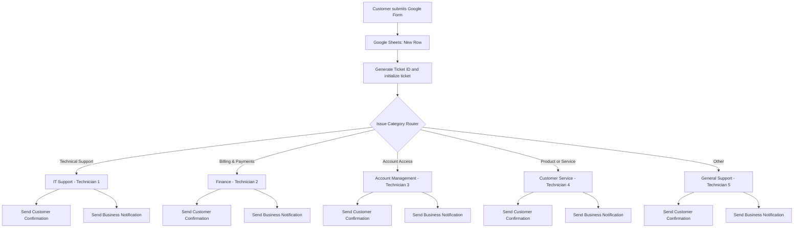
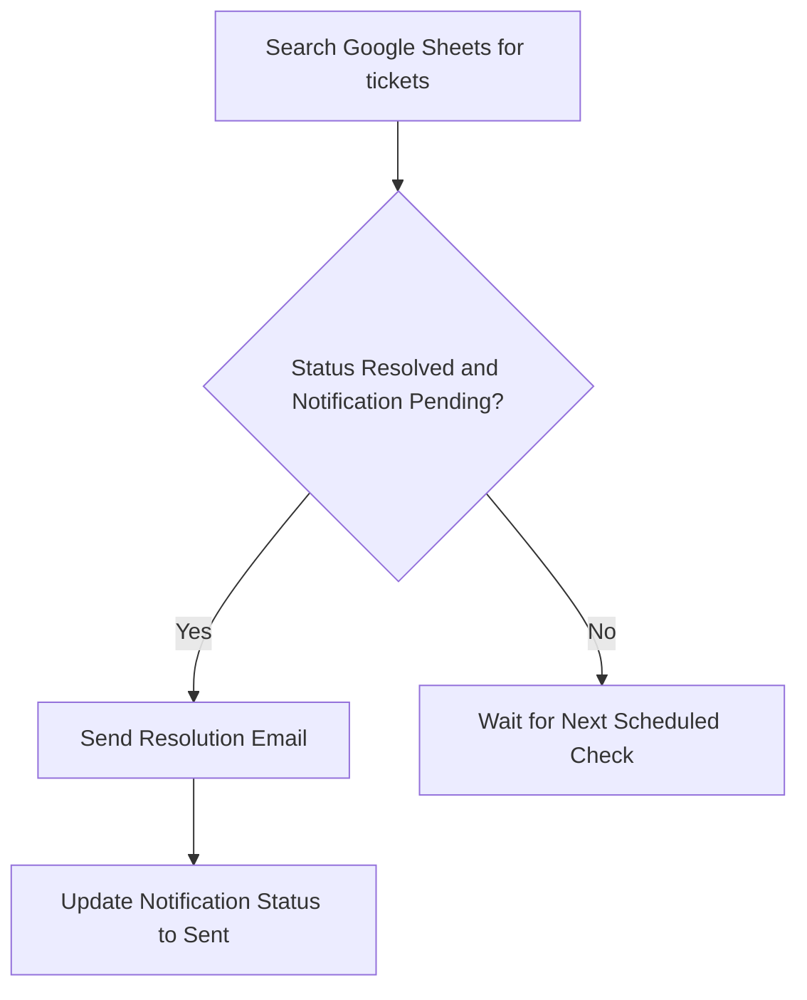

# Workflow Diagram – Customer Support Ticket Management Automation

## Workflow 1: Ticket Registration and Assignment

```mermaid
flowchart TD
    A[Customer submits Google Form] --> B[Google Sheets: New Row]
    B --> C[Generate Ticket ID and initialize ticket]
    C --> D{Issue Category Router}

    D -->|Technical Support| E[IT Support - Technician 1]
    D -->|Billing & Payments| F[Finance - Technician 2]
    D -->|Account Access| G[Account Management - Technician 3]
    D -->|Product or Service| H[Customer Service - Technician 4]
    D -->|Other| I[General Support - Technician 5]

    E --> J[Send Customer Confirmation]
    E --> K[Send Business Notification]
    F --> L[Send Customer Confirmation]
    F --> M[Send Business Notification]
    G --> N[Send Customer Confirmation]
    G --> O[Send Business Notification]
    H --> P[Send Customer Confirmation]
    H --> Q[Send Business Notification]
    I --> R[Send Customer Confirmation]
    I --> S[Send Business Notification]
```

## Workflow 2: Resolution Notification

```mermaid
flowchart TD
    A[Search Google Sheets for tickets] --> B{Status Resolved and Notification Pending?}
    B -->|Yes| C[Send Resolution Email]
    C --> D[Update Notification Status to Sent]
    B -->|No| E[Wait for Next Scheduled Check]
```

